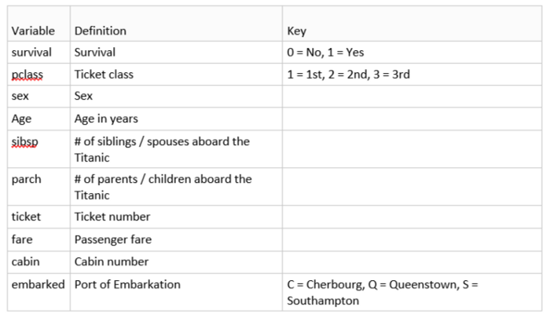

# 🚢 Titanic-Survival-Prediction

## 🚀 Problem Statement
The Titanic struck an iceberg on 15 April 1912 that caused its sinking, leading to the death of more than 1,500 people. This made it one of the deadliest sinking of a single ship. We will try to predict whether a particular person on Titanic survived or not using 11 features about them

Following are the steps we are going to follow to predict the price of the houses in the Boston Suburb.
1. Importing the data through Kaggle
2. Analyzing the data
3. Cleaning the data
4. Feature Selection
5. Model Selection
6. Training the data
7. Testing the data
8. Conclusion

## Data Description
